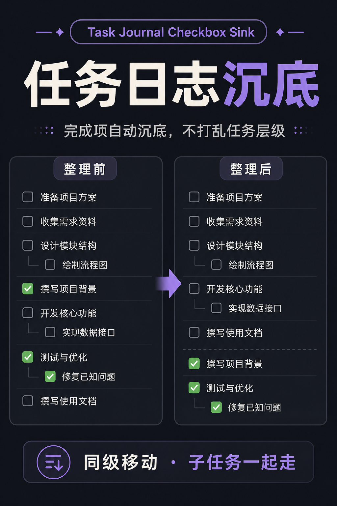
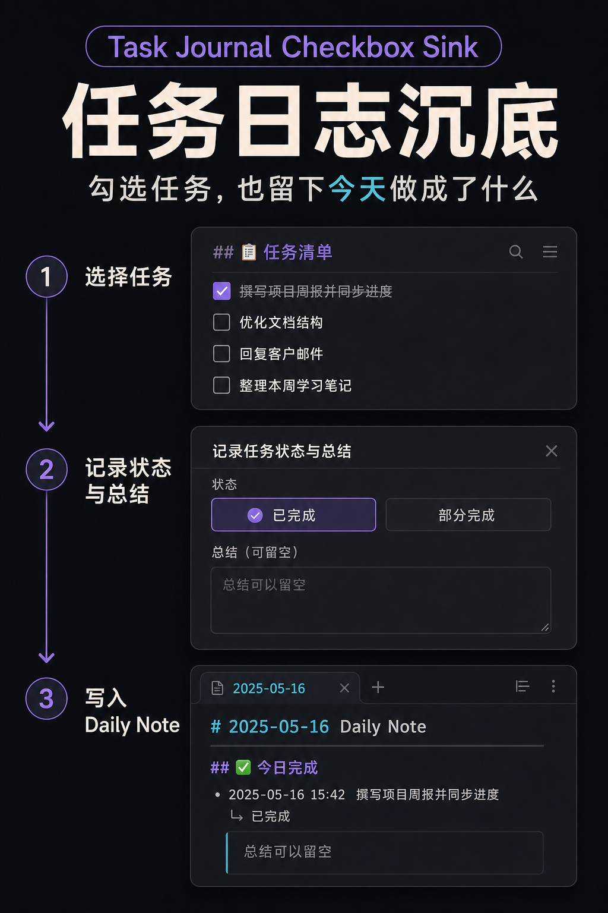
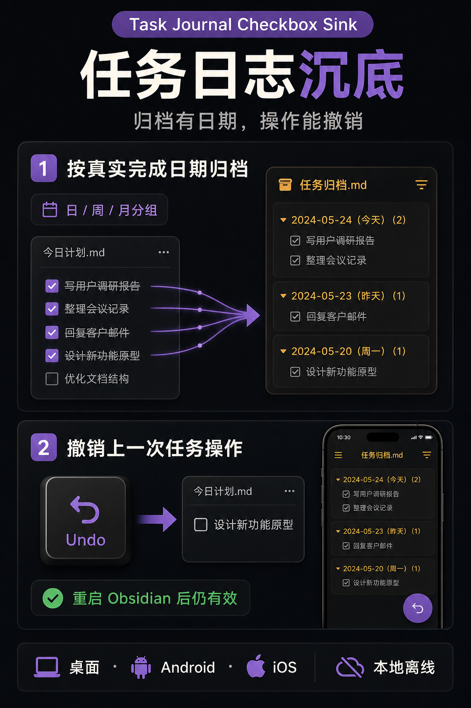
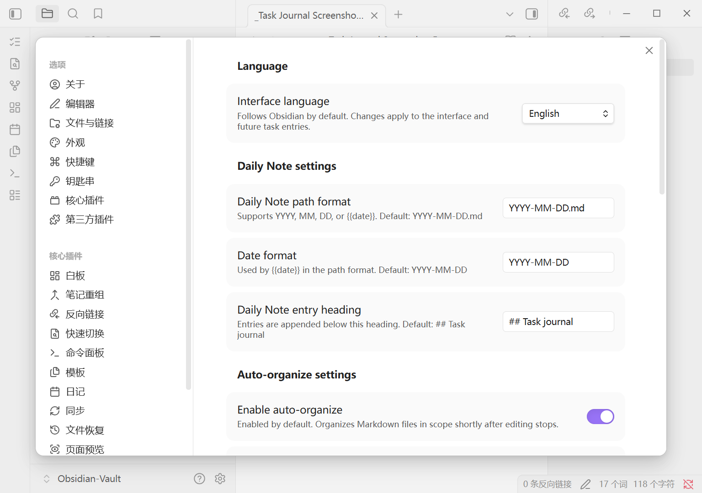
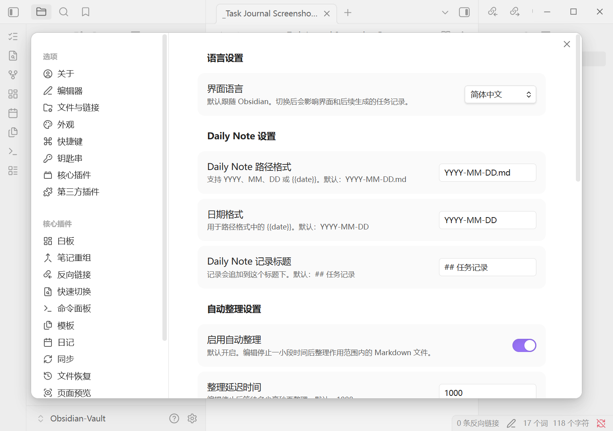
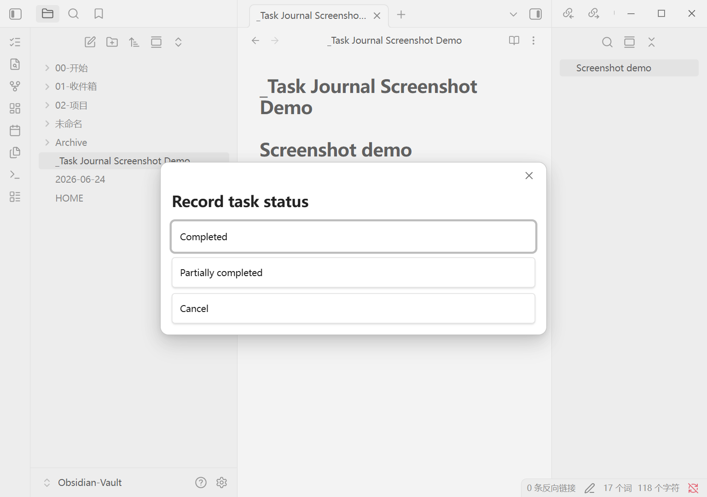
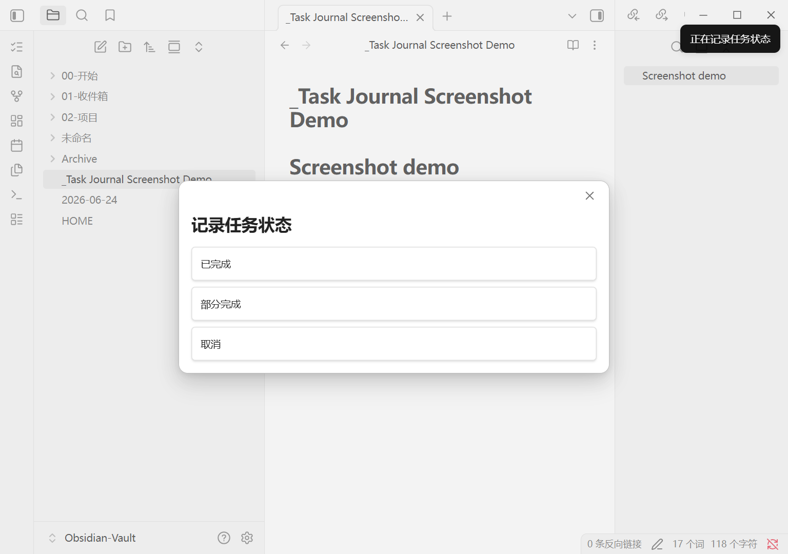

# Task Journal Checkbox Sink

> Keep a centralized Obsidian task page readable: sink completed tasks safely, record outcomes in Daily Notes, archive by completion date, and undo the latest operation.

[English](#english) | [中文](#中文说明) | [Releases](https://github.com/inciyang2022-a11y/task-journal-checkbox-sink/releases) | [Issues](https://github.com/inciyang2022-a11y/task-journal-checkbox-sink/issues)

[](obsidian://show-plugin?id=task-journal-checkbox-sink)

- Available in the official Obsidian Community Plugins directory
- Full English and Simplified Chinese interface
- Desktop, Android, and iOS
- Local and offline: no account, network requests, telemetry, advertising, or payment
- Minimum Obsidian version: `1.6.6`

## English

### What it does

Task Journal Checkbox Sink is designed for people who keep tasks on a centralized Obsidian page.

- **Safely sink completed tasks:** move a completed task only to the end of its current sibling list, without crossing headings or parent tasks.
- **Keep task blocks intact:** child tasks and attached content move with their parent task.
- **Write outcomes to a Daily Note:** record a task as completed or partially completed and add an optional summary.
- **Track native checkbox changes:** store the real completion date and organize completed tasks automatically.
- **Archive by completion date:** archive to a file or a heading in the current note, grouped by day, week, month, or not grouped.
- **Undo the latest operation:** undo the most recent status, checkbox, or archive operation, including after restarting Obsidian.
- **Use it on mobile:** dialogs, touch handling, the software keyboard, and narrow settings screens are supported on Android and iOS.

### Feature preview

| Task sinking | Daily Note entry | Archive and undo |
| --- | --- | --- |
|  |  |  |

### Bilingual interface

| English settings | Simplified Chinese settings |
| --- | --- |
|  |  |

| English task-status dialog | Simplified Chinese task-status dialog |
| --- | --- |
|  |  |

### Install

#### Community Plugins directory (recommended)

[Install Task Journal Checkbox Sink in Obsidian](obsidian://show-plugin?id=task-journal-checkbox-sink)

1. Open **Settings → Community plugins**.
2. Select **Browse** and search for `Task Journal Checkbox Sink`.
3. Select **Install**, then **Enable**.

#### Manual installation

1. Download `main.js`, `manifest.json`, and `styles.css` from [GitHub Releases](https://github.com/inciyang2022-a11y/task-journal-checkbox-sink/releases).
2. Put the three files directly in `.obsidian/plugins/task-journal-checkbox-sink/`.
3. Restart Obsidian and enable the plugin under **Community plugins**.

### Quick start

1. Open the plugin settings. The interface follows Obsidian automatically, or you can choose English or Simplified Chinese.
2. Put the cursor on a Markdown task such as `- [ ] Finish report`.
3. On desktop, select the `list-checks` icon in the left ribbon. You can also run **Record task status** from the command palette, Commander, or a mobile toolbar.
4. Choose **Completed** or **Partially completed**, then enter an optional summary.

Clicking a native Obsidian checkbox also stores its completion date. Auto-organize is enabled for the entire vault on new installations, with `Templates/` and `Archive/` excluded by default. Review these settings before using the plugin in an existing vault.

### Commands

| Command | Purpose |
| --- | --- |
| Record task status | Update the current task, write a Daily Note entry, and sink it when completed |
| Archive completed tasks | Archive completed tasks from the active Markdown file |
| Undo last task operation | Undo the latest operation recorded by the plugin |

### New-installation defaults

- Language: follow Obsidian
- Daily Note path: `YYYY-MM-DD.md`
- Date format: `YYYY-MM-DD`
- English Daily Note heading: `## Task journal`
- Auto-organize: enabled
- Organize delay: `1000ms`
- Scope: entire vault
- Excluded folders: `Templates/` and `Archive/`
- Archive file: `Archive/Done Tasks.md`
- English archive heading: `## Completed tasks archive`
- Archive grouping: day

Updating from an earlier release does not overwrite saved headings, scope, or auto-organize choices.

### Privacy and safety

- The plugin runs locally and does not access files outside the vault.
- Tasks inside fenced code blocks and HTML comments are ignored.
- Tasks never move across headings or parent-task boundaries.
- Undo refuses to overwrite files changed after the recorded operation.
- Completion dates are stored in hidden Markdown comments:
  `%%task-journal-completed:YYYY-MM-DD%%`

### Support

Open a [GitHub issue](https://github.com/inciyang2022-a11y/task-journal-checkbox-sink/issues). Remove names, journals, project details, and other private information from example notes, then provide the smallest Markdown sample that reproduces the problem.

## 中文说明

### 它解决什么问题

Task Journal Checkbox Sink（任务日志沉底）适合在一个 Obsidian 页面中集中管理任务。

- **完成项安全沉底**：只移动到当前缩进层级的同级列表末尾，不跨标题或父任务。
- **保留完整任务块**：子任务和附属内容随父任务一起移动。
- **写入 Daily Note**：记录“已完成”或“部分完成”，并添加可留空的总结。
- **支持原生 checkbox**：记录真实完成日期，并按设置自动整理。
- **按完成日期归档**：归档到指定文件或当前页面标题，可按日、周、月或不分组。
- **撤销上一次操作**：支持状态记录、checkbox 和归档操作，重启 Obsidian 后仍可撤销。
- **支持移动端**：适配 Android、iOS 的触控、软键盘、弹窗和窄屏设置页。

### 安装

#### 官方插件目录（推荐）

[在 Obsidian 中一键打开安装页面](obsidian://show-plugin?id=task-journal-checkbox-sink)

1. 打开 **设置 → 第三方插件 → 浏览**。
2. 搜索 `Task Journal Checkbox Sink`。
3. 选择 **安装**，然后 **启用**。

#### 手动安装

1. 从 [GitHub Releases](https://github.com/inciyang2022-a11y/task-journal-checkbox-sink/releases) 下载 `main.js`、`manifest.json` 和 `styles.css`。
2. 将三个文件直接放入 `.obsidian/plugins/task-journal-checkbox-sink/`。
3. 重启 Obsidian，并在第三方插件中启用。

### 30 秒开始使用

1. 打开插件设置。语言默认跟随 Obsidian，也可以固定为简体中文或 English。
2. 把光标放在标准 Markdown 任务行上，例如 `- [ ] 完成报告`。
3. 桌面端点击左侧功能区的 `list-checks` 按钮；也可以从命令面板、Commander 或手机工具栏运行 **记录任务状态**。
4. 选择“已完成”或“部分完成”，填写可选总结。

新安装默认开启自动整理并作用于全库，同时默认排除 `Templates/` 和 `Archive/`。在已有 Vault 中使用前，建议先检查作用范围和排除文件夹。旧版本升级不会覆盖已经保存的开关、范围或标题。

### 命令

| 命令 | 作用 |
| --- | --- |
| 记录任务状态 | 更新当前任务、写入 Daily Note，并在已完成时沉底 |
| 归档已完成任务 | 归档当前活动 Markdown 文件中的已完成任务 |
| 撤销上一次任务操作 | 撤销最近一次插件任务操作 |

### 新安装默认设置

- 语言：跟随 Obsidian
- Daily Note 路径：`YYYY-MM-DD.md`
- 日期格式：`YYYY-MM-DD`
- 中文记录标题：`## 任务记录`
- 自动整理：开启
- 整理延迟：`1000ms`
- 作用范围：全库
- 排除文件夹：`Templates/`、`Archive/`
- 归档文件：`Archive/Done Tasks.md`
- 中文归档标题：`## 已完成任务归档`
- 归档分组：按天

### 隐私与安全

- 插件完全本地运行，不访问 Vault 外文件。
- 不处理 fenced code block 或 HTML 注释中的任务。
- 不跨标题或父任务移动任务。
- 相关文件在操作后被修改时，整次撤销会拒绝执行。
- 完成日期保存在隐藏 Markdown 注释中：
  `%%task-journal-completed:YYYY-MM-DD%%`

### 反馈问题

请前往 [GitHub Issues](https://github.com/inciyang2022-a11y/task-journal-checkbox-sink/issues)。提交 Markdown 示例前，请删除姓名、日记、项目名称或其他私人内容。

## Development

```bash
npm install
npm run lint
npm test
npm run build
npm run check:release
```

Release assets are `main.js`, `manifest.json`, and `styles.css`. The GitHub release tag must exactly match the version in `manifest.json` and must not start with `v`.

## License

[MIT](LICENSE)
